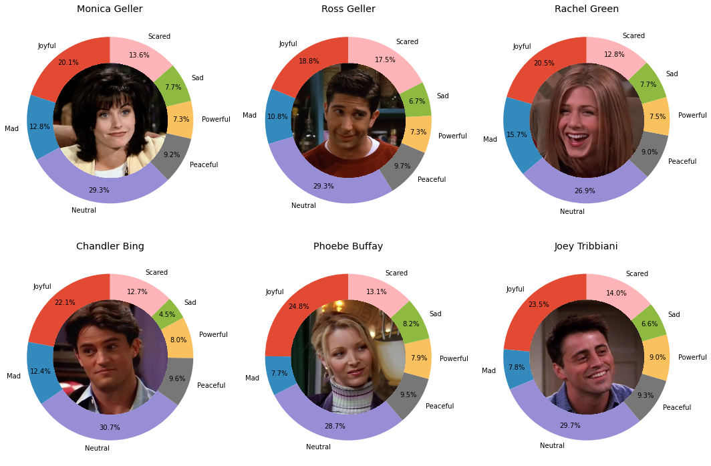
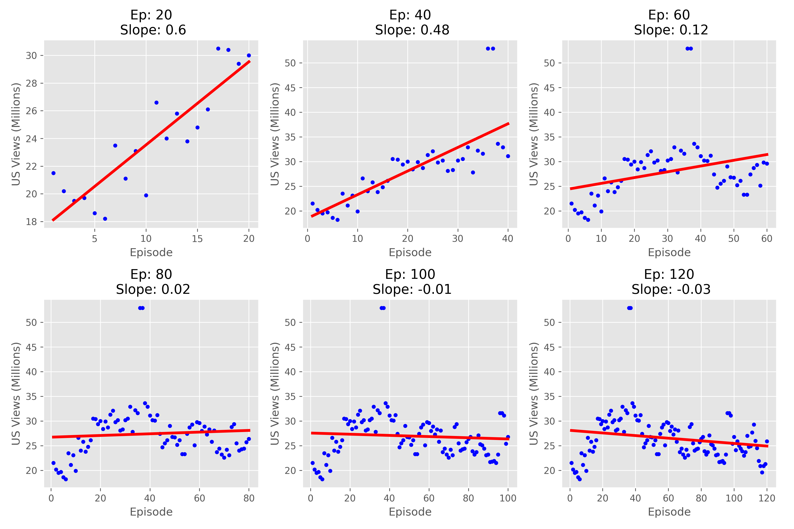

# Rebooting *Friends*: A Data-Driven Blueprint for the Ultimate Reboot

Welcome to the **Rebooting Friends** project! In this analysis, we leverage data-driven insights to explore various aspects of the iconic *Friends* series, aiming to inform and enhance a reboot. From examining the impact of directors on episode ratings and viewership to analyzing character dynamics and relationships, we uncover patterns and trends that can guide the creative direction of the reboot. Our approach incorporates statistical methods, machine learning techniques, and data visualization to provide actionable insights for making informed decisions about character roles, plot structure, and episode pacing.

---

### Key Areas of Analysis:

# Impact of Directors on Episode Ratings and Viewership 🎬⭐  
By comparing the most experienced directors, Gary Halvorson and Kevin S. Bright, we analyzed the ratings and viewership of their episodes using bootstrapping and hypothesis testing. Results showed that Kevin’s episodes generally perform better in terms of ratings and viewership, suggesting his direction could lead to greater success in a reboot.

# Hypothesis Test: Gender Equality in Dialogue 👩⚖️🧑  
We tested whether male main characters speak more lines than their female counterparts. The hypothesis test showed no statistically significant difference, leading us to conclude that dialogue distribution in the reboot should be balanced between male and female characters.

# Investigating Character Dynamics through Emotions 😊😢  
Using sentiment analysis, we explored the emotional dynamics of characters in the first four seasons. This analysis revealed the emotional range of each character, which could inform character development and interactions in the reboot.

# Impact of Relationships on Episode Ratings and Viewership 💞📈  
We examined how romantic relationships among characters influence episode ratings and viewership. permutation test results indicated a positive association between romantic relationships and higher ratings, suggesting their inclusion in the reboot could enhance audience engagement.

# Random Episode Title Generator 🎲📜  
To creatively generate episode titles, we developed a tool using n-grams to mimic the iconic *Friends* format. This tool provides a fun and authentic way to name episodes, ensuring they resonate with fans of the original series.

# Optimal Episode Count for the Reboot 🔢🎥  
Using linear regression, we determined that 80 episodes would strike the perfect balance between maintaining viewer interest and delivering a compelling storyline, based on patterns observed in the original series.

---

### Impact of Directors on Episode Ratings and Viewership 🎬⭐  

In this analysis, we explore the contributions of the most experienced directors and writers in *Friends*, using **Pandas** for data cleaning and manipulation.

#### Most Experienced Directors and Writers
- The most experienced directors: **Gary Halvorson** (average episode rating 8.4 and **Kevin S. Bright** (average episode rating 8.6).
- The most experienced writers: **Ted Cohen** and **Andrew Reich**.

We suspect that Kevin slightly outperforms Gary. To test this, I used **bootstrapping** to estimate the mean rating for the population of episodes each director could have directe. And, calculated the **99% confidence intervals (CIs)** for the mean ratings to assess the reliability of the results. Bootstrapping was chosen because the observed difference in ratings may be influenced by the sample I have. 

The results showed that while Kevin's episodes are generally rated higher, there is some overlap in the CIs. This suggests that Gary's episodes could perform just as well under different circumstances. Therefore, we performed **hypothesis testing**, which ,however, revealed that Kevin’s episodes are rated significantly higher than that of Gary’s.

#### Comparing Viewership of Gary and Kevin's Episodes

Applying the same bootstrapping and hypothesis testing technique to **viewership** data, I found that Kevin’s episodes also attract more views than Gary's, suggesting that Kevin’s episodes perform better both in terms of ratings and viewership.

These insights suggest that involving **Kevin S. Bright** in the reboot may lead to higher ratings and greater viewership. However, Gary’s episodes might still perform well under different conditions.

---

### Hypothesis Test: Gender Equality in Dialogue 👩⚖️🧑  

In our analysis of the dataset, we observed that the proportion of lines spoken by male main characters (Ross Geller, Chandler Bing, Joey Tribbiani) was approximately 0.51, while the proportion of lines spoken by female main characters (Rachel Green, Monica Geller, Phoebe Buffay) was slightly lower at approximately 0.49. These proportions are quite similar but not identical.

To determine whether this difference is due to random chance or if male characters are more likely to speak a greater number of lines throughout the series, we performed a hypothesis test. We obtained a **p-value of 0.0738** from the hypothesis test. Since the p-value is greater than the standard significance level of 0.05 this means that, based on the data from *Friends*, there is no statistically significant evidence to suggest that male characters speak more lines than female characters over the course of the show.

Given the lack of significant evidence for a gender-based disparity in line distribution, we have decided to assign an **equal number of lines** to both male and female main characters in our reboot, ensuring gender balance in dialogue throughout the series.

---

### Investigating Character Dynamics through Emotions 😊😢  

To better understand the emotional dynamics between characters in *Friends*, we analyzed sentiment data from the first four seasons of the show. Since we only have sentiment data for certain lines during these seasons, our investigation is based on this subset of the data.

#### Methodology

We applied **Bayes' Theorem** to predict the probability that a line spoken by a particular character falls under one of the following emotional categories: **Mad**, **Joyful**, **Neutral**, **Peaceful**, **Powerful**, **Sad**, and **Scared**.

By leveraging Bayes' Theorem, we were able to compute the likelihood that a given line reflects each of these emotions based on historical data from the show. This approach helped us make probabilistic predictions about the emotions conveyed in the dialogue of each character.

After predicting the probabilities for each emotion for the various characters, we created a **visualization of speaker emotions**. This visualization illustrates the **similarities and differences** in the types of emotions each character expresses when speaking. It provides insight into how different characters are emotionally portrayed throughout the first four seasons of the show and how they express various emotions like anger, joy, and sadness.

The visualization offers a clear representation of the emotional range and tendencies of each character, revealing interesting patterns about their personalities and interactions. This insight can help the reboot of *Friends* to better develop character arcs, enhance dynamics between characters, and create more authentic and engaging storylines.

---

### Impact of Relationships on Episode Ratings and Viewership 💞📈  

In this section, now we examine whether episodes featuring romantic relationships (e.g., Ross and Rachel, Monica and Chandler) had higher ratings than those without. The **permutation test** resulted in a **p-value of 0.038**, suggesting an association between relationships and higher ratings, although this does not prove causality.

he association between relationships and higher ratings implies that including romantic storylines could enhance episode ratings. These findings will help shape the reboot, balancing character relationships, and plot development to maximize engagement.

---

### Random Episode Title Generator 🎲📜  

To create unique and entertaining episode titles for our reboot, we developed a tool that generates random episode titles inspired by the format used in *Friends*. In the show, episode titles follow a distinctive pattern, such as *"The One with the Morning After"* or *"The One with the Bullies"*.

Our tool works by leveraging **n-grams**, a technique in natural language processing where sequences of 𝑛 words are used to generate new text based on previously observed patterns. Specifically, we use the following approach:

- **n-gram model**: We build sequences of words (n-grams) based on the episode titles and generate new titles by predicting each next word.
- **Conditional probability**: For a given value of 𝑛, the tool generates each subsequent word by considering only the **previous word** in the sequence, using the conditional probability of that word appearing after the word before it.

### Example Generated Titles:
- The One with Rachel's Dream
- The One with the Girl Who Hits Joey Speaks French
- The One with the Birth Mother
- The One Where They're Up All the Haste
- The One with the Birth Mother

This tool adds a fun and creative twist to the process of naming episodes and ensures that each generated title feels authentically *Friends*-inspired.

---

### Optimal Episode Count for the Reboot 🔢🎥  
In our reboot of *Friends*, we first compared the viewership of episodes in the first half (seasons 1-5) and the second half (seasons 6-10) of the original series. We suspected that the first half would have higher viewership than the second half. To test this hypothesis, we performed a permutation test, which resulted in a p-value of 0.001, confirming that the first half of the series had significantly higher viewership than the second half.

Building on this insight, I then used linear regression techniques to analyze how viewership changed with the number of episodes. By examining various episode counts, I found that excitement among viewers remained high up to 30 episodes but gradually faded as the sitcom progressed. Based on this analysis, I determined that **80 episodes** would be the optimal choice for the reboot, ensuring it remains fresh and engaging without overstaying its welcome, maximizing both viewer satisfaction and long-term success.

## Contributions 🤝

This project was developed as part of my [DSC 10](https://catalog.ucsd.edu/courses/DSC.html) course at UC San Diego. I would like to express my gratitude to the [DSC 10 team](https://dsc10.com/staff/) for their invaluable guidance throughout this project. They provided essential insights, data sources, and helpful hints that significantly shaped my analysis and kept the project on track.

The DSC 10 team also played a key role in transforming my analysis into a more accessible and user-friendly format. I am extremely grateful for their support and contributions, without which this project would not have been possible.

## References and Data Sources 📖

Below are links to all the resources I used in developing this project. Thanks to DSC 10 team who provided these resources!

- The data for this project is sourced from [Kaggle](https://www.kaggle.com), a platform offering publicly accessible datasets, including those related to TV shows like Friends. The dataset includes details on episodes, dialogue lines, and character emotions.

Dataset URL: [Kaggle Friends Dataset](https://www.kaggle.com/datasets/sujaykapadnis/friends?select=friends.csv)
